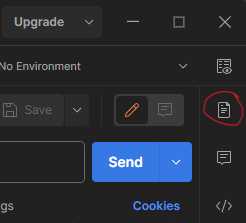

# pm2md

Convert a Postman collection to markdown documentation.

[sample result](samples/calendar-API-v1.md)

**Template-driven**. You can customize the output by editing a template. See the "custom templates" section below for more details.

## download

3 choices for how to download:

* [download a zipped executable file](https://github.com/wheelercj/pm2md/releases), unzip it, and run the app with `./pm2md --help`
* `go install github.com/wheelercj/pm2md@latest` and then `pm2md --help`
* install from source following the instructions below

### install from source

These steps require [Go](https://go.dev/) to be installed.

1. Choose one of the source code download options [here](https://github.com/wheelercj/pm2md/releases) and unzip the folder (or use `git clone`).
2. Open a terminal in the new folder.
3. Run `go build` to create an executable file.
4. Run `go install` to install the executable file. If you get an error message, you may need to [edit your PATH environment variable](https://go.dev/doc/tutorial/compile-install).
5. Run the app with `pm2md --help`.

## command examples

* `pm2md collection.json documentation.md` reads collection.json and saves markdown to documentation.md.
* `pm2md collection.json` reads collection.json and saves markdown to a new file with a unique name based on the collection's name. This will NEVER replace an existing file.
* `pm2md collection.json --statuses=200` does the same as the previous example but does not include any sample responses except those with a status code of 200.
* `pm2md collection.json --statuses=200-299,400-499` does not include any sample responses except those with a status code within the ranges 200-299 and 400-499 (inclusive).
* `pm2md collection.json -` reads collection.json and returns markdown to stdout.
* `pm2md - -` receives JSON from stdin and returns markdown to stdout, such as with `cat collection.json | pm2md - -`.
* `pm2md - out.md` receives JSON from stdin and saves markdown to out.md.

### custom templates

You can customize the output by editing a template.

* `pm2md --get-default` creates a new file of [the default template](cmd/default.tmpl) as a starting point for customization.
* `pm2md --get-minimal` creates a new file of [a minimal template](cmd/minimal.tmpl).
* `pm2md api.json --template=custom.tmpl` reads api.json and formats text using a custom template file named custom.tmpl. The result is saved into a new file with a unique name.
* `pm2md test api.json custom.tmpl expected.md` tests whether your custom template's output matches your expected result, and gives a helpful error message if it doesn't.

In a template, you can use the functions in the `FuncMap` in [func_map.go](cmd/func_map.go). Sometimes it's helpful to look at the JSON exported from Postman to know what variables are available. pm2md adds a "level" integer property to each Postman item and response (folders, endpoints, and responses). These template docs might also be helpful:

* [the template package — Go's standard library](https://pkg.go.dev/text/template)
* [How To Use Templates in Go — DigitalOcean](https://www.digitalocean.com/community/tutorials/how-to-use-templates-in-go#step-4-writing-a-template)

## tips

Any descriptions and examples you want to add to pm2md's output can usually be added in Postman. pm2md can then take those and automatically put them in the result for you. For example, after clicking "Send" in Postman, a "Save as Example" button appears so you can save a sample request and response. Also, there are many places in Postman to add descriptions to things, including collections, folders, requests, and more.

To add a description to a request, click the documentation button near the top-right corner:

Here's how to export a collection from Postman (choose the v2.1 export option):

## developer resources

* [intro to Go](https://wheelercj.github.io/notes/pages/20221122173910.html)
* [JSON and Go — The Go Blog](https://go.dev/blog/json)
* [the embed package — Go's standard library](https://pkg.go.dev/embed)
* [spf13/cobra](https://github.com/spf13/cobra)
* [GoReleaser](https://goreleaser.com/)
* [GoReleaser Action](https://github.com/marketplace/actions/goreleaser-action)
* [how to create a custom terminal command](https://wheelercj.github.io/notes/pages/20220320181252.html)
* [Command Line Interface Guidelines](https://clig.dev/) by Prasad et al.
